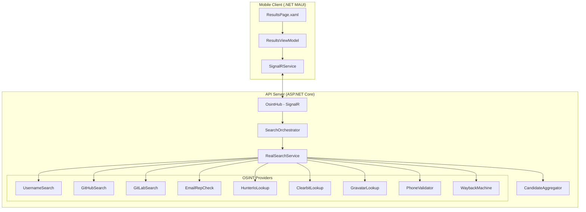
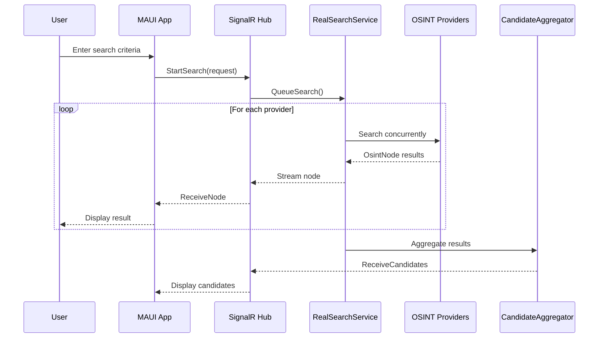

# Poirot OSINT - Project Documentation

## Project Overview

**Poirot OSINT** is a comprehensive Open Source Intelligence (OSINT) application built with .NET MAUI for mobile clients and ASP.NET Core for the backend API. The application allows users to search for digital footprints of individuals across multiple online platforms using various identifiers like email, nickname, full name, or phone number.

---

## Architecture



---

## Solution Structure

```
prnet_project/
├── src/
│   ├── SherlockOsint.Api/           # Backend API
│   │   ├── Hubs/
│   │   │   └── OsintHub.cs          # SignalR hub for real-time communication
│   │   ├── Services/
│   │   │   ├── RealSearchService.cs # Main search orchestration
│   │   │   ├── SearchOrchestrator.cs # Queue management
│   │   │   ├── CandidateAggregator.cs # Identity correlation
│   │   │   └── OsintProviders/      # 21 OSINT data providers
│   │   └── Program.cs               # Dependency injection setup
│   │
│   ├── SherlockOsint.Mobile/        # MAUI Mobile App
│   │   ├── Views/
│   │   │   ├── SearchPage.xaml      # Search input form
│   │   │   └── ResultsPage.xaml     # Results display
│   │   ├── ViewModels/
│   │   │   ├── SearchViewModel.cs
│   │   │   └── ResultsViewModel.cs
│   │   └── Services/
│   │       └── SignalRService.cs    # Real-time communication
│   │
│   └── SherlockOsint.Shared/        # Shared Models
│       └── Models/
│           ├── SearchRequest.cs
│           ├── OsintNode.cs
│           ├── TargetCandidate.cs
│           └── SourceEvidence.cs
```

---

## Key Components

### 1. Mobile Client (SherlockOsint.Mobile)

#### SearchPage.xaml / SearchViewModel.cs
- **Purpose**: Entry point for user searches
- **Features**:
  - Input fields for: Email, Nickname, Full Name, Phone Number
  - Validation before submission
  - Navigation to ResultsPage with search parameters

#### ResultsPage.xaml / ResultsViewModel.cs
- **Purpose**: Display search results in real-time
- **Features**:
  - Real-time streaming of results via SignalR
  - **Clickable source links** using `ContentView` + `TapGestureRecognizer`
  - Target candidate cards with probability scoring
  - Country distribution visualization
  - Identity signals display

**Key Code - Click Handling (ResultsPage.xaml lines 125-176)**:
```xml
<ContentView Padding="0" Margin="0,2">
    <ContentView.GestureRecognizers>
        <TapGestureRecognizer Command="{Binding ...OpenSourceUrlCommand}"
                              CommandParameter="{Binding .}" />
    </ContentView.GestureRecognizers>
    <Frame InputTransparent="True">
        <!-- All children have InputTransparent="True" -->
    </Frame>
</ContentView>
```

#### SignalRService.cs
- **Purpose**: Manages real-time communication with backend
- **Events**:
  - `NodeReceived` - Individual OSINT findings
  - `CandidatesReceived` - Aggregated identity candidates
  - `SearchCompleted` / `SearchError`

---

### 2. Backend API (SherlockOsint.Api)

#### OsintHub.cs (SignalR Hub)
- **Purpose**: WebSocket endpoint for real-time communication
- **Methods**:
  - `StartSearch(SearchRequest)` - Initiates search
  - `CancelSearch()` - Stops ongoing search
- **Broadcasts**:
  - `ReceiveNode` - Stream individual findings
  - `ReceiveCandidates` - Send aggregated results

#### RealSearchService.cs
- **Purpose**: Orchestrates OSINT data collection
- **Key Features**:
  - Uses `System.Threading.Channels` for non-blocking streaming
  - Parallel execution of multiple OSINT providers
  - Throttling for recursive searches (max depth: 2)
  - Handle permutation limits to prevent API overload

**Key Code - Streaming Architecture**:
```csharp
public async IAsyncEnumerable<OsintNode> SearchAsync(SearchRequest request, CancellationToken ct)
{
    var channel = Channel.CreateUnbounded<OsintNode>();
    
    // Background worker populates channel
    _ = Task.Run(async () => {
        // Run OSINT providers concurrently
        channel.Writer.TryComplete();
    }, ct);
    
    // Stream results as they arrive
    await foreach (var node in channel.Reader.ReadAllAsync(ct))
        yield return node;
}
```

#### CandidateAggregator.cs
- **Purpose**: Correlates OSINT data into identity candidates
- **Features**:
  - Username grouping and normalization
  - Probability scoring (0-100%)
  - Confidence interval calculation
  - `ExtractValidUrl()` - Ensures only HTTP URLs are stored

**Key Code - URL Validation (lines 377-394)**:
```csharp
private string ExtractValidUrl(OsintNode node)
{
    if (!string.IsNullOrEmpty(node.Value) && 
        node.Value.StartsWith("http", StringComparison.OrdinalIgnoreCase))
        return node.Value;
    
    // Check children for URLs
    foreach (var child in node.Children)
        if (child.Value?.StartsWith("http") == true)
            return child.Value;
    
    return "";
}
```

---

### 3. OSINT Providers (21 Total)

| Provider | File | Description | Data Retrieved |
|----------|------|-------------|----------------|
| **UsernameSearch** | UsernameSearch.cs | Searches 30+ platforms | Profile URLs, bios, locations |
| **GitHubSearch** | GitHubSearch.cs | GitHub API integration | Repos, contributions, email |
| **GitLabSearch** | GitLabSearch.cs | GitLab API integration | Projects, profile data |
| **EmailRepCheck** | EmailRepCheck.cs | Email reputation check | Deliverability, breach status |
| **HunterIoLookup** | HunterIoLookup.cs | Email verification | Domain emails, confidence |
| **ClearbitLookup** | ClearbitLookup.cs | Company/person enrichment | Name, company, social links |
| **GravatarLookup** | GravatarLookup.cs | Gravatar profile | Photo, verified email |
| **PhoneValidator** | PhoneValidator.cs | Phone number analysis | Country, carrier, type |
| **HibpBreachCheck** | HibpBreachCheck.cs | Have I Been Pwned | Breach history |
| **WaybackMachine** | WaybackMachineLookup.cs | Archive.org lookups | Historical snapshots |
| **IdentityLinker** | IdentityLinker.cs | Cross-platform correlation | Identity signals |
| **CountryDetector** | CountryDetector.cs | Geographic inference | Location probabilities |
| **DomainWhoisLookup** | DomainWhoisLookup.cs | WHOIS data | Domain ownership |
| **EmailDiscovery** | EmailDiscovery.cs | Email pattern generation | Possible email addresses |
| **FullContactLookup** | FullContactLookup.cs | Person enrichment | Demographics |
| **PgpKeyserverLookup** | PgpKeyserverLookup.cs | PGP key search | Public keys |
| **ProfileVerifier** | ProfileVerifier.cs | Profile validation | Confidence scoring |
| **RedditDiscovery** | RedditDiscovery.cs | Reddit user search | Post history |
| **StackOverflow** | StackOverflowDiscovery.cs | SO user search | Reputation, tags |
| **WebSearchProvider** | WebSearchProvider.cs | Web scraping | General mentions |
| **YouTubeDiscovery** | YouTubeDiscovery.cs | YouTube channel search | Channel info |

---

### 4. Shared Models (SherlockOsint.Shared)

#### SearchRequest.cs
```csharp
public class SearchRequest
{
    public string? Email { get; set; }
    public string? Nickname { get; set; }
    public string? FullName { get; set; }
    public string? Phone { get; set; }
}
```

#### OsintNode.cs
- Represents individual OSINT findings
- Hierarchical structure with parent-child relationships
- Contains `Label`, `Value` (URL), `Depth`

#### TargetCandidate.cs
- Aggregated identity candidate
- Properties: `Name`, `ProbabilityScore`, `ConfidenceLow/High`
- Contains `List<SourceEvidence>` for source platforms

#### SourceEvidence.cs
```csharp
public class SourceEvidence
{
    public string Platform { get; set; }     // "GitHub", "Twitter", etc.
    public string Icon { get; set; }         // "[GH]", "[TW]"
    public string Url { get; set; }          // Clickable profile URL
    public string Username { get; set; }     // Username on platform
    public int ContributionScore { get; set; }
    public string Explanation { get; set; }
}
```

---

## Data Flow



---

## Technologies Used

| Category | Technology |
|----------|------------|
| **Mobile Framework** | .NET MAUI 10.0 |
| **Backend Framework** | ASP.NET Core 10.0 |
| **Real-time Communication** | SignalR |
| **MVVM Toolkit** | CommunityToolkit.Mvvm |
| **HTTP Client** | IHttpClientFactory |
| **Async Streaming** | System.Threading.Channels |
| **Target Platform** | Android (API 21+) |

---

## Key Features

1. **Real-time Streaming**: Results appear as they're discovered, not after full search completion
2. **Multi-source Correlation**: Combines data from 21+ OSINT sources
3. **Probability Scoring**: Each identity candidate has a confidence score
4. **Clickable Source Links**: Tap any source to open the profile in browser
5. **Throttled Recursion**: Prevents API rate limits with smart depth limits
6. **Cross-platform Identity Linking**: Detects same person across platforms

---

## Configuration

API keys should be configured in `appsettings.json`:

```json
{
  "Osint": {
    "HunterApiKey": "your-hunter-api-key",
    "ClearbitApiKey": "your-clearbit-api-key",
    "EmailRepApiKey": "your-emailrep-api-key",
    "HibpApiKey": "your-hibp-api-key"
  }
}
```

---

## Running the Application

1. **Start the API**:
   ```bash
   cd src/SherlockOsint.Api
   dotnet run
   ```

2. **Build and deploy Mobile App**:
   ```bash
   cd src/SherlockOsint.Mobile
   dotnet build -f net10.0-android
   # Deploy APK to device
   ```

3. **Configure API URL** in mobile app settings to point to your API server.

---

## Security Considerations

- API keys stored in server-side configuration only
- No sensitive data cached on mobile device
- HTTPS required for production deployment
- Rate limiting implemented to prevent abuse

---

*Documentation generated for Poirot OSINT project presentation*
